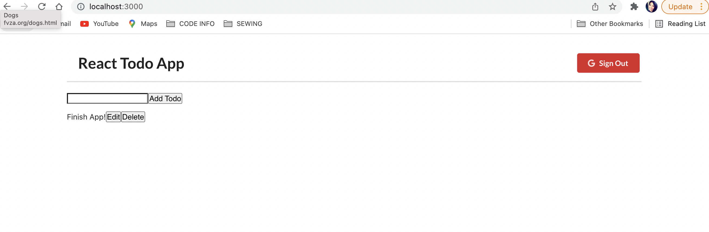

# react-todos-app
A single page application built with react which allows the user to login, add, edit, delete & update todos. App
can fetch todos from jsonplaceholder api.

## About The Project

 Single page application built with react which allows the user to login, add, edit, delete & update todos. App
can fetch todos from jsonplaceholder api.

## Built With

- Create-react-app
- Redux
- HTML / CSS

## Prerequisites
 - Git
 - Node.js
 - NPM

## Credit

👤 **India G**

-   Github: [indieg21](https://github.com/indieg21)
-   Twitter: [@IndieTheTechGi1](https://twitter.com/IndieTheTechGi1)
-   Linkedin: [linkedin](https://www.linkedin.com/in/india-g-a9046b78/)
-   <Indiagraham21@gmail.com>
-   <https://indieart.myportfolio.com/>

## Screenshots

## Usage

- git clone git@github.com:indieg21/react-todos-app.git

- cd react-todos-app

- npm install

- npm start

## Show your support

Give a ⭐️ if you like this project!

